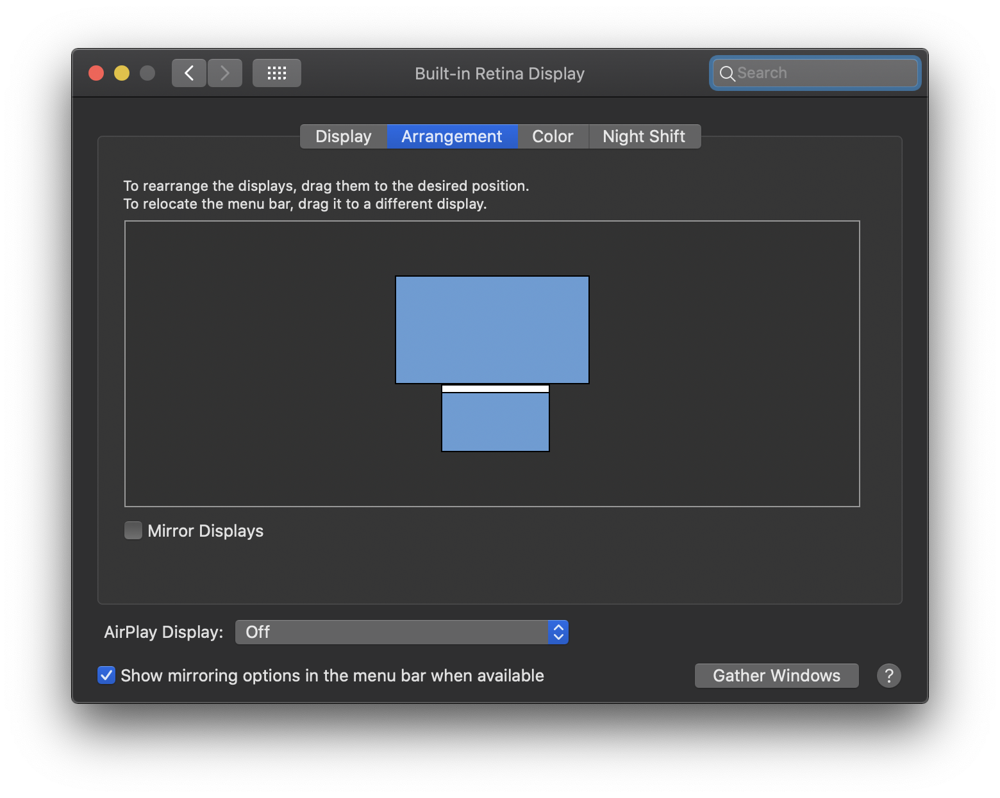
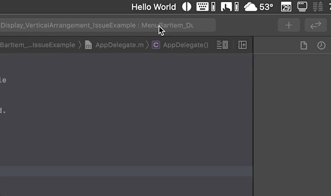

# MenuBarItemVerticalDisplaysIssue
Sample project for macOS Bug Report

In macOS Catalina, including the most current public release (19A603), if a user has two (2) displays connected to their Mac and those displays are stacked vertically (see attached screen shot of system Preferences Display panel), menu bar items fail to display their menu when clicked. This issue is only present on the bottommost display. The issue does not occur on the topmost display.\

**Example Display Arrangement**\
Built-in display on bottom, external display on top.\

**External (top) Display Behavior**\

**Built-in (bottom) Display Behavior**\

